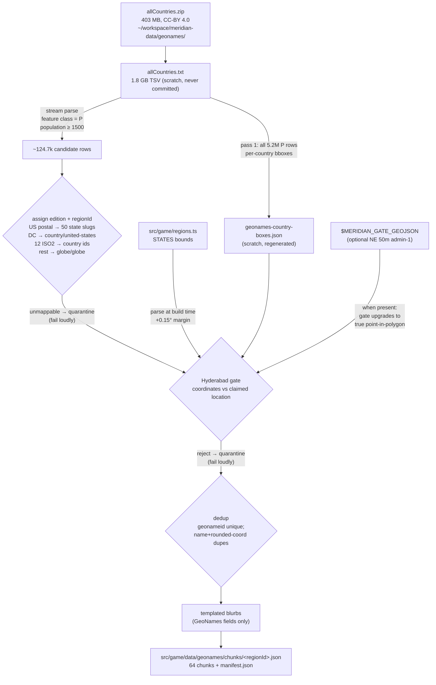

# Meridian GeoNames dataset — 100k+ place pipeline

**Date:** 2026-09-30
**Status:** built on `feat/geonames-100k`; integration (wiring the game to the chunks) is a separate step.
**Source data:** GeoNames `allCountries` dump, CC-BY 4.0 — attribution required in the app (integration step).
**Approach:** source-authoritative gazetteer data, templated factual blurbs. No language model, no network at build time.

## What it is

A 100k+ place catalog replacing the F6b 3,468-place generated dataset, built from the GeoNames gazetteer (13.5M rows). Every place keeps a populated-place feature class, a population ≥ 1,500, a game edition + regionId assignment, a Hyderabad-gate pass, and a factual blurb templated from GeoNames fields only. Output is per-region JSON chunks the game can load lazily.

## Pipeline

Reproduce: `node scripts/build-geonames-dataset.mjs` (node stdlib only). Same scratch inputs → same outputs byte-for-byte. The zip + script reproduce everything; the extracted TSV is scratch.

## Threshold rationale

Measured on the live dump (feature class P):

| Threshold | Raw rows |
|---|---|
| ≥ 1,000 | 148,276 |
| ≥ 1,200 | 137,113 |
| **≥ 1,500** | **124,690** |
| ≥ 2,000 | 110,545 |
| ≥ 5,000 | 69,238 |

Mandate: ≥ 100,000 shipped, preferring higher-population (more quiz-worthy) places. ≥ 2,000 would clear 100k on only a ~10% quarantine/dedup margin; **≥ 1,500** keeps a ~25% margin while lifting the bar well above 1,000. Small-state depth also argues against pushing higher than needed.

## Mapping rules

Extends `scripts/assign-place-editions.mjs` (F6b). GeoNames US admin1 codes are bare postal codes (`NE`, `DC`, …) — verified against the dump (52 distinct values: 50 states + DC + none empty at ≥ 1,500 pop).

- `US` + postal in the 50-state table → `state` / `<slug>` (table cross-checked against `regions.ts` STATES ids at build time; mismatch fails loudly)
- `US` + `DC` → `country` / `united-states` (not a state, joins the US country pool — same rule as F6b)
- `CA/MX/BR/GB/FR/DE/IT/EG/IN/CN/JP/AU` → `country` / `<country id>` (same 12 as F6b)
- everything else with a country code → `globe` / `globe`
- missing country code or unknown US admin1 → **quarantine, fail loudly** (non-zero exit only if a shipped violation occurs; quarantines are reported, never silent)

US territories with their own ISO codes (PR, GU, …) map by country code like any other country — they are not US states.

## Hyderabad gate design

Veeresh's permanent hard rule: coordinates must match the claimed location. Two geometry levels; the level used is recorded in `manifest.json` (`meta.gateGeometry`) and every chunk's `meta`.

**This build: `country-boxes-from-geonames`.** Country/globe places are checked against per-country boxes derived from ALL 5.2M GeoNames P rows (min/max per country code, padded 0.5°, minimum 2°×2°, antimeridian-aware 0–360 frame for span > 180° — same convention as F6b). State places are checked against boxes parsed at build time from `src/game/regions.ts` STATES bounds (+0.15° margin), so the gate can never drift from the game's region authority.

**Why not F6b's `country-boxes.json`:** those boxes were derived from the NE 10m populated-places dataset (a few thousand sparse points) and are systematically too tight at geographic extremes. A trial run against them rejected 74 genuinely-correct places: Easter Island (CL), Bornholm (DK), Okinawa's western islands (JP), Mohe county (CN), Fernando de Noronha (BR), the Ogaden (ET), Far North Cameroon, southern Algeria, Kiritimati (KI), the Marquesas (PF), Batanes (PH), Flores/Azores (PT), Rodrigues (MU), Annobón (GQ), and more. GeoNames' own 5.2M places are two orders of magnitude denser, so the derived boxes cover the real extremes. `country-boxes.json` itself is untouched — it still gates F6b's dataset.

**Why not `STARTER_STATE_BOXES`:** a trial run rejected 20 genuinely-correct US places at state edges those boxes clip — WV's northern panhandle (Weirton 40.42°N vs box maxLat 39.9), MS's eastern edge (Iuka −88.19 vs box maxLon −88.3), ND's Red River valley (Fargo −96.79 vs box maxLon −96.8), TX's western tip (Anthony −106.61 vs box minLon −106.5). `regions.ts` bounds contain all of them. (`validate-places.ts` itself is untouched — flagging the WV/MS/ND/TX box tightness to the integration step.)

**Upgrade path — `admin1-polygons`:** the script already implements true point-in-polygon checks (ray casting, bbox prefilters, holes handled by even-odd rule) that activate when `$MERIDIAN_GATE_GEOJSON` points at a Natural Earth 50m admin-1 GeoJSON: state places checked against their STATE's polygons, country/globe places against ANY admin-1 polygon of their claimed country (grouped by `iso_a2`). The vendored `src/map/data/ne-50m-admin-1.json` covers only AU/BR/CA/CN/IN — not worldwide — so it cannot serve. Downloading the worldwide file needs Veeresh's approval (audit below); re-running the script with it set upgrades the gate with no code changes.

### Natural Earth 50m admin-1 download — groundwork for approval

- **What:** `ne_50m_admin_1_states_provinces.zip` — worldwide state/province boundary polygons for the polygon-level Hyderabad gate.
- **Source:** `https://naturalearth.s3.amazonaws.com/50m_cultural/ne_50m_admin_1_states_provinces.zip` — Natural Earth's official S3 bucket (naturalearthdata.com itself currently 500s; the S3 bucket is the canonical mirror the site links to). Verified reachable 2026-09-30: HTTP 200, `Content-Length: 911408` (~0.9 MB), `Last-Modified: 2022-05-13`.
- **Audit:** data-only ZIP (shapefile/GeoJSON geography). Parsed with node stdlib, never executed. No code, no binaries. License: Natural Earth data is public domain (no attribution requirement, unlike GeoNames CC-BY).
- **Cost:** zero. Size ~0.9 MB zipped.
- **Why:** the only way to run the specced polygon-level gate (state polygon per state place, admin-1 polygons per country). Nothing vendored provides worldwide admin-1 geometry.

## Blurbs

Templated from GeoNames fields only — name, admin1 name, country name, population, elevation. No language model, no network:

> `<Name> is a populated place in <Admin1>, <Country> (population ~<N>).` + optional ` It sits at ~<E> m elevation.`

City-states and small territories often have no admin1 detail in GeoNames (e.g. Singapore's 112 places); those get a country-only blurb rather than being dropped.

## Deduplication

`geonameid` is unique by construction. Additionally drops exact name + rounded-coordinate (4dp) dupes, keeping the highest-population row (tie → lowest geonameid). Count reported below.

## Quarantine summary

Final build: **zero quarantines, zero gate rejects, zero dedup drops.** All 124,690 candidate rows (feature class P, population ≥ 1,500) mapped, gated, and shipped.

The path to zero is documented because the intermediate failures shaped the gate design:

1. **74 country-box rejects (trial run)** — all verified legitimate geographic extremes (Easter Island, Bornholm, Okinawa's western islands, Mohe, Fernando de Noronha, the Ogaden, Far North Cameroon, southern Algeria, Kiritimati, the Marquesas, Batanes, Flores/Azores, Rodrigues, Annobón, …). Root cause: F6b's `country-boxes.json` was derived from the sparse NE 10m populated-places dataset. Fixed by deriving boxes from all 5.2M GeoNames P rows.
2. **20 US state rejects (trial run)** — all verified legitimate (WV northern panhandle, MS eastern edge, ND Red River valley, TX western tip). Root cause: hand-maintained state boxes clipped real state edges. Fixed by parsing `src/game/regions.ts` STATES bounds (+0.15°).
3. **~400 admin1-name quarantines (first full run)** — city-states and small territories (Singapore's 112 places, etc.) have no admin1 detail in GeoNames. Fixed with a country-only blurb fallback instead of dropping real places.
4. **71 `no-reference-box` quarantines (first full run)** — countries absent from `country-boxes.json` (XK, BQ, GG, JE, NR, SH, AI, PM). Eliminated: GeoNames-derived boxes cover all 248 country codes present in the dump.

### Known limitation: stretched boxes

Boxes are min/max over all GeoNames P rows, so a handful of GeoNames data errors stretch some countries' boxes — e.g. one pop-0 row labeled JP sits in Egypt (31.36°N 30.97°E), stretching Japan's box to 30.5°E; similar single-row outliers affect ~18 other countries (EG, ET, IR, NL, …). This weakens the gate for those countries but caused **zero false passes in the shipped set**: an outlier analysis verified no shipped (pop ≥ 1,500) row sits in any outlier zone. Deliberately not "fixed" with outlier trimming — trimming rules risk reintroducing the exact bug this redesign eliminated (rejecting legitimate isolated extremes like Easter Island, which has 4 clustered rows and survives, but a singleton rule would be one bad heuristic away from dropping it). The `$MERIDIAN_GATE_GEOJSON` polygon upgrade is the real fix.

## Build results (2026-09-30)

- **Shipped: 124,690 places** (mandate: ≥ 100,000 ✓, ~25% margin over the mandate)
- **Chunks: 64** — 50 states + 13 countries + globe
- **Total chunk bytes: 25,136,069 (~24.0 MB)**
- **Gate: `country-boxes-from-geonames`** (Hyderabad gate, 0 rejects)
- **Quarantined: 0** · **Dedup drops: 0** (geonameid unique; no name+coord collisions at this threshold)
- **Build time:** ~146s (two streaming passes over the 1.8 GB dump: box derivation, then build)
- **DC rule:** Washington DC → `country/united-states` (55 places), same as F6b

### Per-region depth

| Region | Places | | Region | Places |
|---|---|---|---|---|
| globe | 59,423 | | california | 1,014 |
| india | 6,990 | | pennsylvania | 915 |
| germany | 6,308 | | new-york | 907 |
| france | 6,293 | | texas | 841 |
| mexico | 5,724 | | florida | 741 |
| brazil | 5,717 | | illinois | 640 |
| italy | 5,234 | | ohio | 577 |
| united-kingdom | 3,394 | | new-jersey | 520 |
| australia | 3,299 | | maryland | 446 |
| china | 3,274 | | massachusetts | 429 |
| canada | 2,462 | | north-carolina | 379 |
| japan | 2,057 | | michigan | 366 |
| egypt | 257 | | washington | 361 |
| united-states (DC) | 55 | | wisconsin | 327 |

Remaining states range from georgia (319) down to north-dakota (36). Full table in `manifest.json`.

### Honest cycle math

Dataset size buys cycle length *per region* — and small states exhaust fast. At 10 questions/day (20/day in parentheses):

- **globe:** 5,942 days (2,971) · **india:** 699 (350) · **california:** 101 (51)
- **nebraska (81):** 8.1 days (4.1) — Veeresh's "exhausts fast" concern, quantified
- **Thinnest states:** north-dakota 36 → 3.6 (1.8) · delaware 42 → 4.2 (2.1) · rhode-island / wyoming 45 → 4.5 (2.3) · nevada 50 → 5.0 (2.5) · south-dakota 51 → 5.1 (2.6) · alaska / vermont 52 → 5.2 (2.6)

The thin tail (NV, AK, ND, …) is a **source-data limitation**, not a pipeline bug: GeoNames simply lacks population figures for most of their places (Nevada has only 1,136 P rows total; 50 clear the ≥ 1,500 bar). Lowering the threshold would deepen these states first — the script takes the threshold as one constant.

## What's NOT in this step

- **Game wiring** (loading chunks, merging with the F6b catalog, dealing) — separate integration step.
- **Attribution UI** — GeoNames is CC-BY 4.0; the app must credit GeoNames. Integration step's job.
- **Polygon gate** — needs Veeresh's approval on the Natural Earth 50m admin-1 download (audit above).

## Integration: game wiring (2026-09-30, `feat/geonames-100k`)

The pipeline above produced the data; this section records how the game
consumes it. Code: `src/game/generated-places.ts` (rewritten),
`src/components/game-app.tsx` (async boundary), `src/components/atlas-map.tsx`
(attribution). F6b's superseded files (`src/game/data/generated-places.json`,
`src/game/data/country-boxes.json`, `scripts/assign-place-editions.mjs`) were
deleted.

### Chunk-loading design

- **No static dataset import.** The 0.85 MB F6b JSON import is gone. The only
  generated-data file in the initial bundle is the ~7 KB `manifest.json`
  (statically imported, inlined).
- **Lazy per-region chunks.** `loadRegionChunk(regionId)` fetches the region's
  chunk with a dynamic `import()` on first use and caches it in memory for
  the session. The bundler emits one lazy asset per chunk (64 files, e.g.
  `texas-<hash>.js` 183 KB, `globe-<hash>.js` 11.4 MB / 59,423 places).
- **Nothing fetched before region selection.** Verified in the built
  `dist/client` output: the initial bundle (`routes-<hash>.js`) contains zero
  `gn-<id>` place records — only the dynamic-import specifier map (path
  strings). `_shell.html` references no chunk.
- **Picker counts from the manifest.** `poolSizeFor(edition, regionId)` =
  curated starters + manifest generated count — chunks are never loaded just
  to count. A unit test locks `poolSizeFor` to the real `placesFor` pool size
  for state/country/globe regions.
- **Fail-closed loading.** Unknown region ids (also a path-traversal guard —
  only manifest-listed regions can become import paths), missing chunks, and
  a single malformed record all reject the whole chunk load. One bad record
  poisons its chunk; partial pools never deal.
- **Dealing contract unchanged.** Curated-first ordering (STARTERS lead),
  F8 `buildRegionPool` fail-closed routing, and `assertAssigned`-style record
  narrowing are preserved; `placesFor(edition, regionId)` is now async.
  `fullCatalog()` / `allGeneratedStarters()` were removed — they required the
  whole 24 MB catalog in memory, which lazy loading exists to avoid.

### Async boundary (game-app)

Region selection is the async boundary: choosing a region shows a "Loading
places" state while its chunk fetches. **A load failure never starts a run**
— the player stays on the menu with an error (fail-closed), never with a
partial/missing pool. The in-run `Play` component also awaits the chunk
(normally an instant cache hit; a fresh fetch after a page reload) with its
own loading and fail-closed error screens.

### Build-time gate

`scripts/check-generated-places.mjs` (still wired as `prebuild` /
`prebuild:pages`) re-validates **100% of shipped chunk places** — 124,690
places in 64 chunks, ~1.4 s — on every build:

- id uniqueness across all chunks (and no collision with curated starter ids,
  locked in unit tests too);
- edition/regionId validity, match against chunk meta + manifest, and
  membership in `regions.ts` STATES/COUNTRIES;
- manifest counts equal real chunk contents;
- **Hyderabad coordinate check** via the real F7 `validateGeneratedPlace`:
  state places against US state boxes parsed from `regions.ts` STATES bounds
  (+0.15° margin, same derivation as the pipeline); country/globe places
  against the checked-in derived per-country box for the place's own `iso2`
  (`src/game/data/geonames/country-boxes.json` — the padded boxes derived
  from all GeoNames P rows, **not** F6b's tight boxes; antimeridian-wrapped
  countries handled in the 0–360 frame). Chunk records carry `iso2` as the
  gate key for exactly this re-check.

Negative-tested: a tampered coordinate and a truncated chunk both fail the
build (exit 1); the clean tree passes with 0 violations.

### Attribution (CC-BY 4.0, mandatory)

- **Visible credit:** the map attribution line in `src/components/atlas-map.tsx`
  now reads "Natural Earth · © OpenStreetMap · **Place data: GeoNames (CC-BY 4.0)**"
  (same tiny muted footer style).
- **Per-place credit:** every generated starter carries `sourceLabel:
  "GeoNames"` / `sourceHref: "https://www.geonames.org/"`, rendered as the
  source link on the result card (`GENERATED_SOURCE_LABEL/HREF` updated from
  Natural Earth).

### Bundle / load impact

| | F6b | GeoNames integration |
|---|---|---|
| Initial bundle generated-data | 0.85 MB static JSON inlined | 0 place records; ~7 KB manifest inlined |
| Region data | all in initial bundle | 64 lazy chunk assets, fetched on region selection only |
| Largest chunk | — | globe: 59,423 places, 11.4 MB emitted JS (~1.8 MB gzip), parsed once then session-cached |
| Typical state chunk | — | e.g. texas: 841 places, 183 KB (27 KB gzip) |

Loading the globe chunk is the worst case and happens at most once per
session, only when the player picks Globe. E2E (built artifact, disk-served)
starts a globe run in ~7 s including the 11 MB parse.
