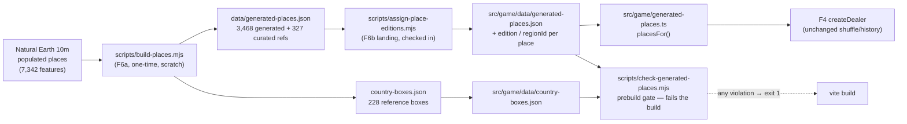

# F6b — Generated place dataset

**Status:** wired into dealing on `feat/place-dataset` (PR-ready, unmerged).
**Source data:** Natural Earth 10m populated places (public domain), built by the
approved F6a pipeline. **Approach C (curated-first hybrid), no language model.**

## What it is

The game used to deal only from 327 hand-curated starters. The F6a pipeline
generated 3,468 additional real places from Natural Earth (cities, towns, and
landmarks with population, feature class, and a factual one-line blurb), each
validated against its country's bounding box. F6b wires that dataset into the
question pool the F4 dealer draws from.

## Pipeline

## Dealing-pool assignment

| Generated places | Edition | RegionId |
|---|---|---|
| US place (via NE `ADM1NAME` join, authoritative — no border guessing) | `state` | state slug, e.g. `texas` (284 places, 48 states) |
| District of Columbia (not a state) | `country` | `united-states` |
| Place in a country-edition country (CA/MX/BR/GB/FR/DE/IT/EG/IN/CN/JP/AU) | `country` | country slug, e.g. `japan` (1,059 places) |
| Everything else (208 ISO codes incl. Somaliland/Kosovo) | `globe` | `globe` (2,125 places) |

Delaware and Vermont have no generated places and keep their curated-only pools.

## Approach C — curated-first

`placesFor(edition, regionId)` returns the hand-curated starters first, then the
generated starters behind them. The curated 327 are never displaced — they keep
their full stories and remain the foundation of every pool. The F4 dealer
(`trail.ts`) shuffles the pool uniformly with per-session seeds and persistent
no-repeat history; "curated first" is inclusion priority, not deal order, and no
dealing mechanics changed.

A generated place becomes a `Starter` with its factual blurb as the story and
`Natural Earth` / `https://www.naturalearthdata.com` as its source label/link.
Curated refs in the dataset JSON are skipped — `starters.ts` is the source of
truth, so curated places can never double-count.

## The Hyderabad rule, permanently

Every generated place is re-validated against its declared country box on every
build through the real F7 gate (`validateGeneratedPlace`):

- `scripts/check-generated-places.mjs` — wired as `prebuild` and
  `prebuild:pages`; any mismatch exits non-zero and **rejects the build loudly**.
  Antimeridian-wrapped countries (RU, NZ, AQ) are normalized into the 0–360 box
  frame before validating, exactly like the F6a verify gate.
- `src/game/generated-places.test.ts` — unit tests: Badville/Goodville fixtures
  prove the gate has teeth, the full 3,468-place dataset passes, ids are unique
  and never collide with curated ids, and every place carries a valid
  edition/regionId.

## Files

- `src/game/data/generated-places.json` — checked-in dataset (~1.0 MB)
- `src/game/data/country-boxes.json` — reference boxes for the gate (~33 KB)
- `src/game/generated-places.ts` — loader + `placesFor()` pool assembly
- `scripts/assign-place-editions.mjs` — one-time landing/enrichment script
  (fails loudly on unassignable places; needs the scratch raw files to re-run)
- `scripts/check-generated-places.mjs` — build-failing import gate
- `src/game/generated-places.test.ts` — unit tests

No new packages. No runtime downloads — the game ships the checked-in data.
